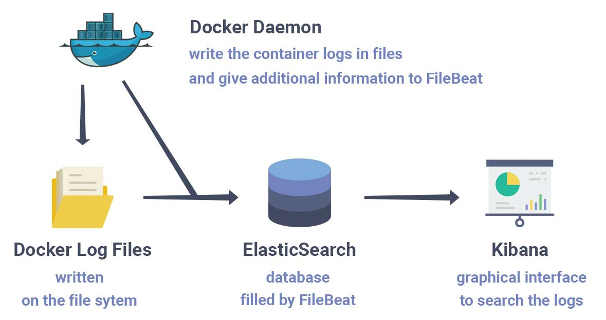
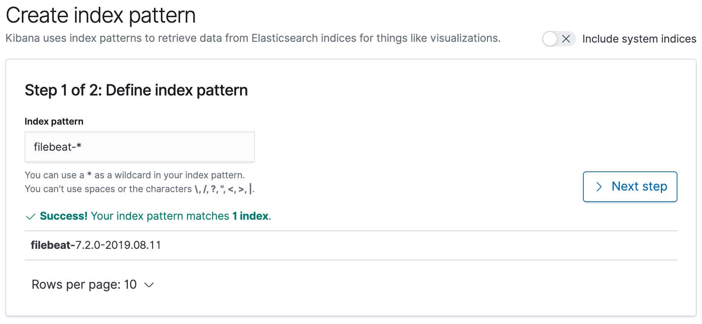
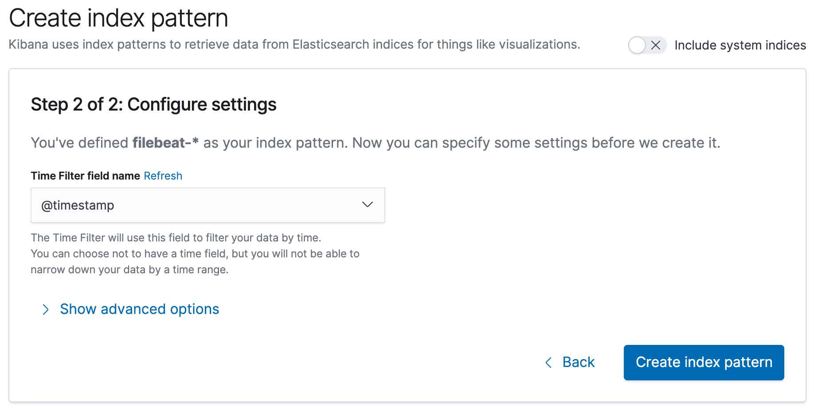
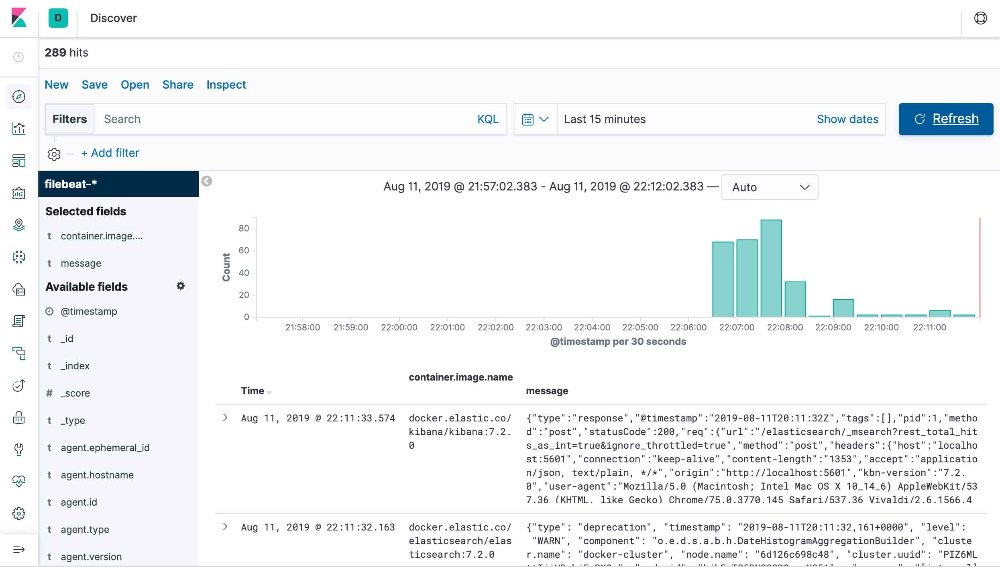

- [Sending Docker Logs to ElasticSearch and Kibana with FileBeat](#sending-docker-logs-to-elasticsearch-and-kibana-with-filebeat)
- [Architecture](#architecture)
- [FileBeat Configuration File](#filebeat-configuration-file)
- [Running everything](#running-everything)
- [Possible Improvements](#possible-improvements)
  - [Removing old logs](#removing-old-logs)
- [Using a Different Index for some Applications](#using-a-different-index-for-some-applications)
- [Conclusion](#conclusion)

# Sending Docker Logs to ElasticSearch and Kibana with FileBeat

If you are looking for a self-hosted solution to store, search and analyze your logs, the ELK stack (ElasticSearch, Logstash, Kibana) is definitely a good choice. The Kibana interface let you very easily browse the logs previously stored in ElasticSearch. Regarding how to import the logs into ElasticSearch, there are a lot of possible configurations. But this is often achieved with the use of Logstash that supports numerous input plugins (such as syslog for example).

In this article I will describe a simple and minimalist setup to make your docker logs available through Kibana. The setup meets the following requirements:

All the docker container logs (available with the docker logs command) must be searchable in the Kibana interface.
Even after being imported into ElasticSearch, the logs must remain available with the docker logs command.
It should be as efficient as possible in terms of resource consumption (cpu and memory).
It should be able to decode logs encoded in JSON.

# tree

# Architecture



Docker writes the container logs in files. FileBeat then reads those files and transfer the logs into ElasticSearch. FileBeat is used as a replacement for Logstash. It was created because Logstash requires a JVM and tends to consume a lot of resources. Although FileBeat is simpler than Logstash, you can still do a lot of things with it.

There are many ways to install FileBeat, ElasticSearch and Kibana. To make things as simple as possible, we will use docker compose to set them up. We will use the official docker images and there will be a single ElasticSearch node.

The docker compose file `docker-compose.yml` looks like this:

```yml
version: "3"
services:
    elasticsearch:
        image: "docker.elastic.co/elasticsearch/elasticsearch:7.2.0"
        environment:
            - "ES_JAVA_OPTS=-Xms1g -Xmx1g"
            - "discovery.type=single-node"
        ports:
            - "9200:9200"
        volumes:
            - elasticsearch_data:/usr/share/elasticsearch/data

    kibana:
        image: "docker.elastic.co/kibana/kibana:7.2.0"
        ports:
            - "5601:5601"

    filebeat:
        image: "docker.elastic.co/beats/filebeat:7.2.0"
        user: root
        volumes:
            - /MY_WORKDIR/filebeat.yml:/usr/share/filebeat/filebeat.yml:ro
            - /var/lib/docker:/var/lib/docker:ro
            - /var/run/docker.sock:/var/run/docker.sock

volumes:
    elasticsearch_data:
```

***__Note that you need to replace /MY_WORKDIR/ by a valid path on your computer for this to work.__***

There is not much to say about ElasticSearch and Kibana as it is a very standard configuration for docker. They are respectively available on port 9200 and 5601. ElasticSearch has a volume to keep its data. Kibana does not need a volume as it uses ElasticSearch to persist its configuration.

FileBeat on the other hand needs a specific configuration file to achieve what we want. To share this configuration file with the container, we need a read-only volume `/usr/share/filebeat/filebeat.yml:ro`. We will see in the next section what to put in this file. FileBeat also needs to have access to the docker log files. You can usually find them in `/var/lib/docker/containers` but that may depends on your docker installation.

The docker socket `/var/run/docker.sock` is also shared with the container. That allows FileBeat to use the docker daemon to retrieve information and enrich the logs with things that are not directly in the log files, such as the name of the image or the name of the container.

There is another subtlety. The user running `FileBeat` needs to be able to access all these shared elements. Unfortunately, the user filebeat used in the official docker image does not have the privileges to access them. That is why the user was changed to `root` in the docker compose file.

# FileBeat Configuration File

The only thing left to do is to create the filebeat configuration file in `/MY_WORKDIR/filebeat.yml:`

```yml
filebeat.inputs:
- type: container
  paths: 
    - '/var/lib/docker/containers/*/*.log'

processors:
- add_docker_metadata:
    host: "unix:///var/run/docker.sock"

- decode_json_fields:
    fields: ["message"]
    target: "json"
    overwrite_keys: true

output.elasticsearch:
  hosts: ["elasticsearch:9200"]
  indices:
    - index: "filebeat-%{[agent.version]}-%{+yyyy.MM.dd}"

logging.json: true
logging.metrics.enabled: false
```

FileBeat has an input type called `container` that is specifically designed to import logs from docker. You only need to specify the location of the log files inside the FileBeat container, which in our case is `/var/lib/docker/containers/*/*.log.`

For the output, there is an `elasticsearch` setting that is also very straightforward. It let you configure the `ElasticSearch` address, but also the indices where the logs are imported. The index pattern `filebeat-%{[agent.version]}-%{+yyyy.MM.dd}` includes the date. That means that the docker logs are imported into the index corresponding to their date of occurrence. This feature is really important if you want to delete old logs.

These settings could be enough but the configuration can really be improved by using two processors. These processors alter the logs to enhance their visualization in Kibana.

The first one is `add_docker_metadata`. Its goal is to enrich the docker logs with useful information, such as the name of the image or the name of the container. If you do not use this processor, you will only have the ids. That would make it very difficult to establish the source of the logs in Kibana.

The second one is `decode_json_fields`. It allows to parse logs encoded in JSON. The logs in FileBeat, ElasticSearch and Kibana consists of multiple fields. The `message` field is what the application (running inside a docker container) writes to the standard output. This message is only a string, but it may contain useful information such as the log level. For example:

```bash
[ERROR] 2000-01-01 00:00:00 Something bad happened.
```

If this string can not be parsed, it will not be possible to filter by log level in Kibana. But if the logs of your application are encoded in JSON, the `decode_json_fields` processor will be able to parse the logs and add new fields that can be exploited in Kibana.

```json
{"level": "error", "time": "2000-01-01 00:00:00", "msg": "Something bad happened"}
```
For this `message` field, the processor adds the fields `json.level`, `json.time` and `json.msg` that can later be used in Kibana. The logs that are not encoded in JSON are still inserted in ElasticSearch, but only with the initial `message` field.

The logging.json and logging.metrics.enabled settings concern FileBeat own logs. They are not mandatory but they make the logs more readable in Kibana.

# Running everything

Now that we are done with the configuration part, you can start the docker-compose file with:

```bash
# in the directory containing the docker-compose.yml file
docker-compose up
```

You can then access kibana in your web browser: [http://localhost:5601](http://localhost:5601).

The first thing you have to do is to configure the ElasticSearch indices that can be displayed in Kibana.



You can use the pattern `filebeat-*` to include all the logs coming from FileBeat.

You also need to define the field used as the log timestamp. You should use `@timestamp` as shown below:



And you are done. You can now visualize the logs generated by FileBeat, ElasticSearch, Kibana and your other containers in the Kibana interface:



# Possible Improvements

## Removing old logs

You can use `curator`, a tool that is also developed by `elastic`, to remove old indices from ElasticSearch. You can install curator by following one of the methods described in the official [documentation](https://www.elastic.co/guide/en/elasticsearch/client/curator/5.x/installation.html).

As we use one ElasticSearch index per day, we can use curator to remove the indices that are older than x days. Curator has a `--dry-run` option that let you see which indices will be deleted without executing the deletion. That means you can try the following command without any risk.

```js
# localhost:9200 is the ElasticSearch address
curator_cli --host localhost:9200 --dry-run delete_indices --filter_list '[
    {
        "filtertype": "pattern",
        "kind": "prefix",
        "value": "filebeat-"
    },
    {
        "filtertype": "age",
        "source": "name",
        "direction": "older",
        "timestring": "%Y.%m.%d",
        "unit": "days",
        "unit_count": 90
    }
]'
```

If you are happy with the result and you want the command to be executed every day, you can add the command to your crontab:

```bash
# open the crontab in your text editor
crontab -e
```

The command must be on a single li

```bash
# delete FileBeat indices older then 90 days from ElasticSearch (every day at 1am)
0 1 * * * curator_cli --host localhost:9200 --dry-run delete_indices --filter_list '[{"filtertype": "pattern", "kind": "prefix", "value": "filebeat-"}, {"filtertype": "age", "source": "name", "direction": "older", "timestring": "%Y.%m.%d", "unit": "days","unit_count": 90}]'
```

# Using a Different Index for some Applications

It is possible to send the logs to different indices in ElasticSearch according to some of their properties (source, log level, …). For example we could use an index for the logs generated by FileBeat, ElasticSearch and Kibana, and another index for the other applications.

```yml
output.elasticsearch:
  hosts: ["elasticsearch:9200"]
  indices:
    - index: "filebeat-elastic-%{[agent.version]}-%{+yyyy.MM.dd}"
      when.or:
        - equals:
            container.image.name: docker.elastic.co/beats/filebeat:7.2.0
        - equals:
            container.image.name: docker.elastic.co/elasticsearch/elasticsearch:7.2.0
        - equals:
            container.image.name: docker.elastic.co/kibana/kibana:7.2.0
    - index: "filebeat-apps-%{[agent.version]}-%{+yyyy.MM.dd}"
```

If you configure an index pattern for `filebeat-elastic-*` and `filebeat-apps-* ` in Kibana, it can make it easier to browse the logs.

You can check the [FileBeat documentation](https://www.elastic.co/guide/en/beats/filebeat/current/elasticsearch-output.html) to help you create your own conditions.

Note that conditions can also be applied to processors.

# Conclusion

Configuring FileBeat to send logs from Docker to ElasticSearch is quite easy. The configuration can also be adapted to the needs of your own applications without requiring too much effort. FileBeat is also a small footprint software that can be deployed painlessly no matter what your production environment may look like.

# Errors 

If you got this error

```bash
Exiting: error loading config file: config file ("filebeat.yml") must be owned by the beat user (uid=0) or root
```

Solution:

```bash
sudo chown root ./filebeat/filebeat.yml
sudo chmod go-w ./filebeat/filebeat.yml
```

[Origina post](https://www.sarulabs.com/post/5/2019-08-12/sending-docker-logs-to-elasticsearch-and-kibana-with-filebeat.html)
